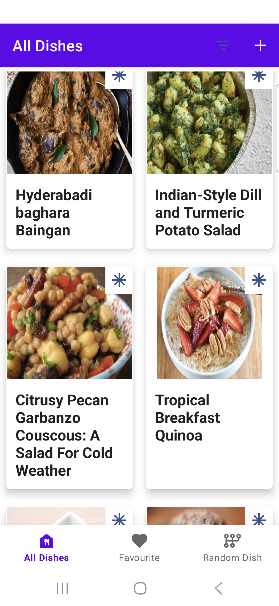
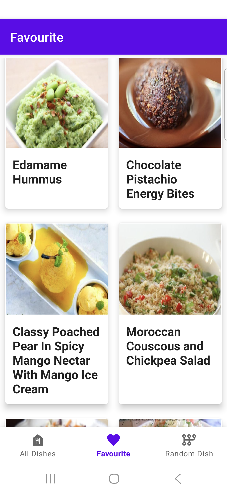
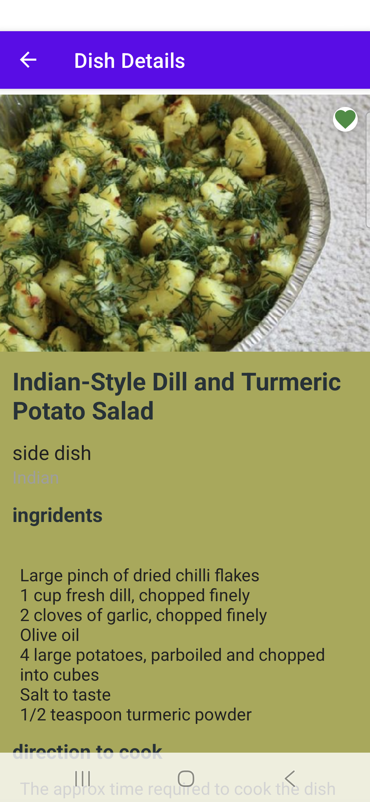
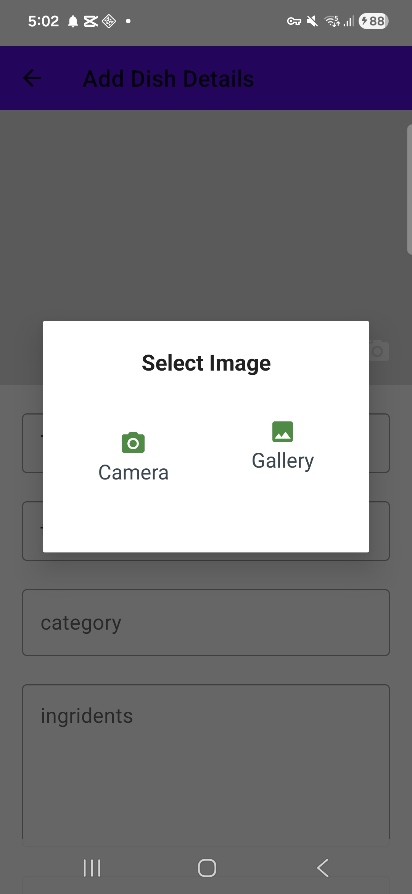
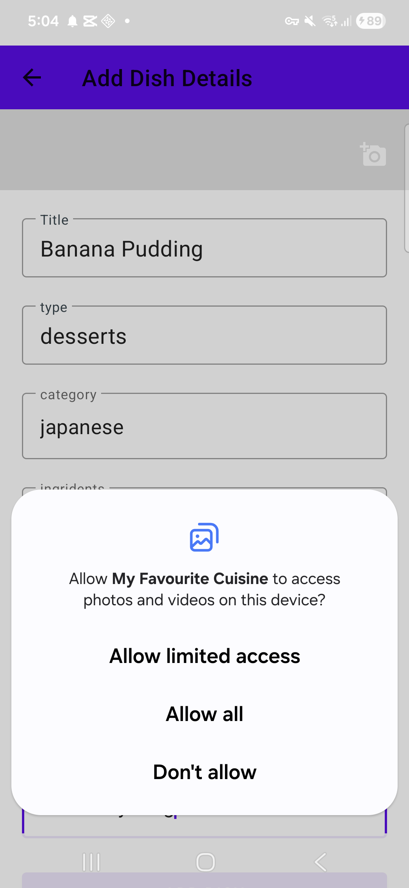

<div align="center">

# 🍽️ MyFavouriteCuisine

### A Modern Android Food Management Application

[](https://www.android.com/)
[](https://kotlinlang.org/)
[](https://android-arsenal.com/api?level=29)
[](https://developer.android.com/jetpack/guide)

A modern Android application for managing and discovering your favorite dishes, built with the latest Android development best practices and technologies.

</div>

---

## 📸 App Screenshots

<div align="center">

### 🎯 Main Features

<table>
  <tr>
    <td align="center">
      
      <br/><b>All Dishes</b>
    </td>
    <td align="center">
      
      <br/><b>Favorites</b>
    </td>
    <td align="center">
      
      <br/><b>Dish Details</b>
    </td>
    <td align="center">
      
      <br/><b>Add Dish</b>
    </td>
  </tr>
  <tr>
    <td align="center">
      
      <br/><b>Image Selection</b>
    </td>
    <td align="center">
      
      <br/><b>Permissions</b>
    </td>
    <td align="center" colspan="2">
      <i>🚀 More screenshots coming soon...</i>
      <br/><small>Random Dish, Filter, Notifications</small>
    </td>
  </tr>
</table>

</div>

---

## 📱 About The Project

MyFavouriteCuisine is a comprehensive food management application that allows users to:
- Add, update, and manage their favorite dishes with images
- Discover random recipes from an external API
- Mark dishes as favorites
- Filter dishes by type (breakfast, lunch, dinner, snacks, etc.)
- Receive periodic notifications about new dishes
- View detailed information about each dish including ingredients and cooking instructions

## ✨ Key Features

### 🎨 User Interface & Experience
- **Splash Screen Animation** - Engaging animated splash screen with custom animations
- **Bottom Navigation** - Intuitive navigation between All Dishes, Favorites, and Random Dish sections
- **RecyclerView with GridLayout** - Efficient display of dishes in a 2-column grid
- **Swipe to Refresh** - Pull-to-refresh functionality for fetching new random dishes
- **Custom Dialogs** - Custom image selection and filter dialogs
- **Dynamic Color Palette** - Background colors extracted from dish images using Android Palette API
- **Responsive UI** - Smooth animations and transitions throughout the app

### 📸 Image Management
- **Camera Integration** - Capture dish photos directly from the camera
- **Gallery Selection** - Choose images from device gallery
- **Image Caching** - Efficient image loading and caching with Glide
- **Multiple Android Version Support** - Proper permission handling for Android 9 to Android 13+
- **MediaStore API** - Modern image storage using MediaStore for Android 10+

### 🗄️ Data Management
- **Room Database** - Local persistence with SQLite database
- **CRUD Operations** - Complete Create, Read, Update, Delete functionality
- **Flow & Coroutines** - Reactive data streams with Kotlin Flow
- **Repository Pattern** - Clean separation of data sources
- **Type Filtering** - Filter dishes by category (breakfast, lunch, dinner, snacks, etc.)
- **Favorite Management** - Mark/unmark dishes as favorites

### 🌐 Network & API Integration
- **Retrofit** - RESTful API integration for fetching random recipes
- **RxJava3** - Reactive programming for API calls
- **Gson Converter** - JSON parsing and serialization
- **API Key Management** - Secure API key storage using BuildConfig
- **Error Handling** - Comprehensive error handling for network requests

### 🔔 Background Processing
- **WorkManager** - Periodic background tasks for notifications
- **Notification Channels** - Android O+ notification channel support
- **Custom Notifications** - Rich notifications with images and actions
- **Constraint-based Scheduling** - Smart notification scheduling based on battery and network state

### 🔐 Permissions Management
- **Runtime Permissions** - Dynamic permission requests using Dexter library
- **Version-specific Permissions** - Different permission handling for Android 9, 10-12, and 13+
  - Camera permission
  - Storage permissions (READ/WRITE_EXTERNAL_STORAGE for older versions)
  - Media permissions (READ_MEDIA_IMAGES, READ_MEDIA_VIDEO, READ_MEDIA_AUDIO for Android 13+)
  - Notification permissions (POST_NOTIFICATIONS for Android 13+)
- **Permission Rationale** - User-friendly dialogs explaining why permissions are needed

### 🏗️ Architecture & Design Patterns
- **MVVM Architecture** - Model-View-ViewModel pattern for clean separation of concerns
- **ViewBinding** - Type-safe view access replacing findViewById
- **LiveData & StateFlow** - Lifecycle-aware observable data holders
- **ViewModel** - UI-related data that survives configuration changes
- **Navigation Component** - Single-activity architecture with fragment navigation
- **Safe Args** - Type-safe navigation argument passing
- **Dependency Injection** - Manual DI with Application class and lazy initialization

## 🛠️ Technical Skills Demonstrated

### Android Development
- **Kotlin** - Primary programming language
- **Android SDK** - Target SDK 36, Min SDK 29
- **Jetpack Components** - Comprehensive use of Android Jetpack libraries
- **Material Design** - Modern UI following Material Design guidelines
- **Lifecycle Management** - Proper handling of Android lifecycle

### Libraries & Frameworks
| Library | Purpose |
|---------|---------|
| **Room** | Local database with SQLite |
| **Retrofit** | REST API client |
| **RxJava3 & RxAndroid** | Reactive programming |
| **Glide** | Image loading and caching |
| **WorkManager** | Background task scheduling |
| **Navigation Component** | Fragment navigation |
| **Palette API** | Color extraction from images |
| **Dexter** | Runtime permissions |
| **Kotlin Coroutines** | Asynchronous programming |
| **Kotlin Flow** | Reactive streams |
| **ViewBinding** | Type-safe view access |
| **Gson** | JSON serialization/deserialization |

### Development Practices
- **Clean Architecture** - Separation of concerns with layers
- **Repository Pattern** - Abstraction of data sources
- **Observer Pattern** - Reactive UI updates
- **Singleton Pattern** - Single instance of database and API service
- **Factory Pattern** - ViewModel factory for dependency injection
- **Version Control** - Git with proper .gitignore configuration
- **Build Configuration** - Gradle with Kotlin DSL
- **ProGuard** - Code obfuscation and optimization ready

## 📂 Project Structure

```
app/
├── src/main/
│   ├── java/com/example/myfavouritecuisine/
│   │   ├── application/          # Application class
│   │   ├── model/
│   │   │   ├── database/         # Room database, DAO, Repository
│   │   │   ├── entities/         # Data classes
│   │   │   ├── network/          # Retrofit API service
│   │   │   └── notification/     # WorkManager notification worker
│   │   ├── utils/                # Constants and utility classes
│   │   ├── view/
│   │   │   ├── activities/       # Activities (MainActivity, SplashActivity, etc.)
│   │   │   ├── adapter/          # RecyclerView adapters
│   │   │   └── fragments/        # Fragments for each screen
│   │   └── viewmodel/            # ViewModels
│   ├── res/
│   │   ├── anim/                 # Animation resources
│   │   ├── drawable/             # Vector drawables and images
│   │   ├── layout/               # XML layouts
│   │   ├── menu/                 # Menu resources
│   │   ├── navigation/           # Navigation graph
│   │   └── values/               # Strings, colors, themes
│   └── AndroidManifest.xml
└── build.gradle.kts
```

## 🚀 Getting Started

### Prerequisites
- Android Studio Hedgehog or later
- JDK 11 or higher
- Android SDK 36
- Spoonacular API key (for random dish feature)

### Installation

1. Clone the repository
```bash
git clone https://github.com/yourusername/MyFavouriteCuisine.git
```

2. Create `apikeys.properties` file in the root directory
```properties
API_KEY="your_spoonacular_api_key_here"
```

3. Open the project in Android Studio

4. Sync Gradle files

5. Run the app on an emulator or physical device

## 🔑 Key Learnings

Through this project, I have gained hands-on experience with:

1. **Modern Android Development** - Using the latest Jetpack libraries and best practices
2. **Asynchronous Programming** - Mastering Kotlin Coroutines, Flow, and RxJava
3. **Database Management** - Implementing Room database with complex queries
4. **API Integration** - Working with RESTful APIs using Retrofit
5. **Permission Handling** - Managing runtime permissions across different Android versions
6. **Background Tasks** - Scheduling periodic work with WorkManager
7. **UI/UX Design** - Creating intuitive and responsive user interfaces
8. **Architecture Patterns** - Implementing MVVM architecture for maintainable code
9. **Image Processing** - Handling images from multiple sources with proper caching
10. **Notification System** - Creating rich, actionable notifications

## 🎯 Future Enhancements

- [ ] Add sharing functionality for dishes
- [ ] Implement search functionality
- [ ] Add user authentication
- [ ] Cloud sync with Firebase
- [ ] Recipe recommendations based on user preferences
- [ ] Shopping list generation from ingredients
- [ ] Meal planning calendar
- [ ] Dark mode support

## 📄 License

This project is created for learning and portfolio purposes.

## 👤 Developer

**Your Name**
- GitHub: [@yourusername](https://github.com/yourusername)
- LinkedIn: [Your LinkedIn](https://linkedin.com/in/yourprofile)

---

⭐ If you found this project helpful, please consider giving it a star!
